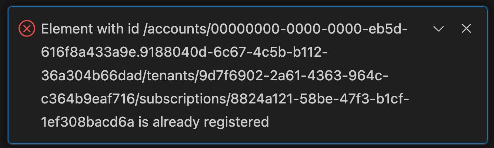
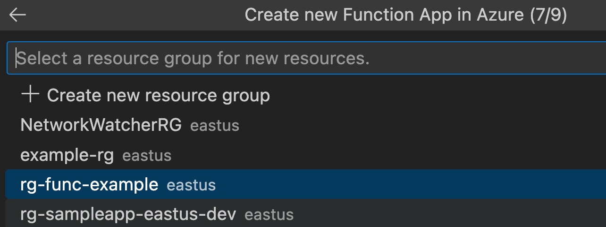

# csharp-func
Trying Azure Functions in various scenarios using C# language.

## Trigger Azure Functions on blob containers using an event subscription
https://learn.microsoft.com/en-us/azure/azure-functions/functions-event-grid-blob-trigger?pivots=programming-language-csharp

Send feedback to MS Learn:
https://microsoft.qualtrics.com/jfe/form/SV_6hUVpRBU3hQVnZY?original_url=https%3A%2F%2Flearn.microsoft.com%2Fen-us%2Fazure%2Fazure-functions%2Ffunctions-event-grid-blob-trigger%3Fpivots%3Dprogramming-language-csharp&locale=en-us&pageTemplate=Conceptual

### Local setup
1. Install VS Code.
2. Install `C# Dev Kit` extension. It brings `C#` extension with it. Follow the "Get Started with C# Dev Kit" steps:
   - Connect account: Sign in with your Microsoft account.
   - Set up your environment: Install .NET SDK. 
   - ...check out the other options.
   - Mark Done
3. Install [Azure Functions extension](https://marketplace.visualstudio.com/items?itemName=ms-azuretools.vscode-azurefunctions) for Visual Studio Code.
   - Or if you're using Rider, install Azure functions core tools:
     - Install
       ```bash
       brew tap azure/functions
       ```
     - Check the location where it's installed.
       ```bash
       $ which func
       /opt/homebrew/bin/func
       ```
4. Install the [Azurite v3 extension](https://marketplace.visualstudio.com/items?itemName=Azurite.azurite) for Visual Studio Code.
   - It gets installed at: `/Users/ashishkhanal/.vscode/extensions/azurite.azurite-3.34.0`
   - Or if you're using Rider, install Azurite using npm (not necessary if you're using VSCode).
      - Install
        ```bash
        npm install -g azurite
        ```
      - Check the location where it's installed. You'll use this to tell Rider where to find Azurite (Settings -> Tools -> Azure -> Azurite).
        ```bash
        $ which azurite
        /Users/ashishkhanal/.nvm/versions/node/v23.10.0/bin/azurite
        ```
      - Go to Services (Cmd+8) -> Azurite emulator -> Start/Stop Azurite
      - Reference 1: https://learn.microsoft.com/en-us/azure/storage/common/storage-use-azurite?tabs=npm%2Cblob-storage#command-line-options
      - Reference 2: https://archive.ph/51s5G
5. Install [Azure Storage extension](https://marketplace.visualstudio.com/items?itemName=ms-azuretools.vscode-azurestorage) for Visual Studio Code.
6. Install Azure Storage explorer.
   - https://azure.microsoft.com/en-us/products/storage/storage-explorer

### Create a blob triggered function
Using Visual Studio makes this process quite easy.

### Prepare local storage emulation
Make sure your `local.settings.json` has `AzureWebJobsStorage` pointing to local storage.
```json
{
  "IsEncrypted": false,
  "Values": {
    "AzureWebJobsStorage": "UseDevelopmentStorage=true",
    "FUNCTIONS_WORKER_RUNTIME": "dotnet-isolated",
    "5f2f77_STORAGE": "UseDevelopmentStorage=true"
  }
}
```

#### Start Azurite Blob Storage service emulator
Press F1 to open the command palette, type `Azurite: Start Blob Service`, and press enter.


#### Upload file to Azurite
Azure Icon in the left side bar > **Workspace** > **Attached Storage Accounts** > **Local Emulator** >, right click **Blob Containers** > **Create Blob Container**

Enter the name: `samples-workitems` > Press Enter.

Expand **Blob Containers** > **samples-workitems** and select **Upload files** > `/` > Enter > Select the file.


#### Browse using Azure Storage Explorer (not necessary though)
Use this to view files if you'd like. 


### Run the function locally
1. Set a breakpoint inside `EventGridBlobTrigger.Run()` method and press F5 to start your project for local debugging.  
   Azure Functions Core tools will run in your Terminal window.

   But we have a problem!
   ```bash
   Azure Functions Core Tools
   Core Tools Version:       4.0.7030 Commit hash: N/A +bb4c949899cd5659d6bfe8b92cc923453a2e8f88 (64-bit)
   Function Runtime Version: 4.1037.0.23568
   
   [2025-04-05T03:39:20.168Z] Found /Users/ashishkhanal/RiderProjects/csharp-func/csharp-func.csproj. Using for user secrets file configuration.
   [2025-04-05T03:39:21.161Z] Worker process started and initialized.
   
   Functions:
   
           EventGridBlobTrigger: blobTrigger
   
   For detailed output, run func with --verbose flag.
   [2025-04-05T03:39:26.162Z] Host lock lease acquired by instance ID '0000000000000000000000006845BABF'.
   [2025-04-05T03:39:45.423Z] An unhandled exception has occurred. Host is shutting down.
   [2025-04-05T03:39:45.424Z] Azure.Core: Connection refused (127.0.0.1:10001). System.Net.Http: Connection refused (127.0.0.1:10001). System.Net.Sockets: Connection refused.
   [2025-04-05T03:39:51.450Z] Unable to get table reference or create table. Aborting write operation.
   [2025-04-05T03:39:51.450Z] Azure.Core: Connection refused (127.0.0.1:10002). System.Net.Http: Connection refused (127.0.0.1:10002). System.Net.Sockets: Connection refused.
    *  Terminal will be reused by tasks, press any key to close it. 
   ```
   
   **Cause of the issue:**

   The instruction in the docs to only start blob service causes this.
   
   **Solution:**

   The solution was to start all services with: `F1 -> Azurite: Start`

   

   To turn them all off: `F1 -> Azurite: Close`

2. Azure Icon in the left side bar > **Workspace** > **Local Project** > **Functions**, right click the function, and select **Execute Function Now**.
3. Put the correct file name (`test.txt`) when it asks you to enter the request body.
   
   
4. Press Enter to run the function. The value you provided is the path to your blob in the local emulator. 
   This string gets passed to your trigger in the request payload, which simulates the payload when an event 
   subscription calls your function to report a blob being added to the container.
5. You'll see the breakpoint being hit and when you continue, you'll see in the output the name of the file and its contents logged.
   
   
6. Stop using `^C`.
7. More info on debugging in VS Code: https://code.visualstudio.com/docs/csharp/debugging

### Azure extension issues in VS Code
The extension gets stuck on infinite loading screen and is extremely slow in VS Code.  
So I tried logging out and logging in.

1. Ran into issues

   
2. Find Azure account and log out
   <p>
     
    &nbsp;
     
   </p>
3. Sign in to Azure using az cli within VS Code terminal. I'm not sure if this step helped or not.
4. Sign in to Azure using VS Code Azure extension.

   

This solved the issue!

#### Azure extension works great in Rider
It's works normally in JetBrains Rider when you login through az cli (`az login`) before you login to Rider.

<p>
  
&nbsp;
  
</p>

### Prepare to publish the function to Azure
https://learn.microsoft.com/en-us/azure/azure-functions/functions-event-grid-blob-trigger?pivots=programming-language-csharp#prepare-the-azure-storage-account

Just follow along the guide linked above.

#### Create Azure Storage account
Creating storage account from VS Code creates a new storage account under a new resource group it creates that has the same name as the storage account name.

That's why I opted to do this using JetBrains Rider Azure extension.

<p>
  
&nbsp;
  
</p>

Also create a new container inside **rg-func-example** > **ashk12** > **Blob Containers** > Name it: **samples-workitems**

#### Create Azure function
F1 > enter **Azure Functions: Create function app in Azure...(Advanced)**

<p>
  
&nbsp;
  
</p>

<p>
  
&nbsp;
  
</p>

<p>
  
&nbsp;
  
</p>

<p>
  
&nbsp;
  
</p>

<p>
  
&nbsp;
  
</p>


